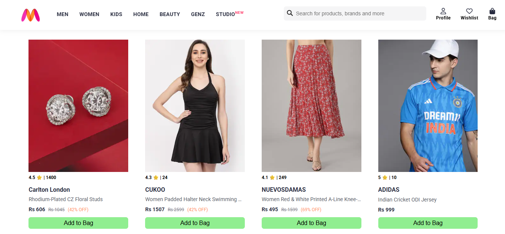
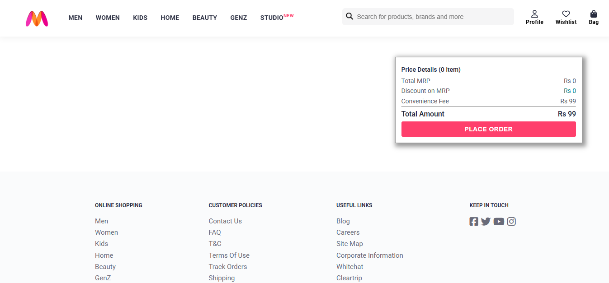

# 🛍️ Myntra Clone

A fully responsive **frontend-only e-commerce clone of Myntra**, built using **HTML**, **CSS**, and **JavaScript**. This project simulates a basic shopping experience, including:

- Product listing
- Add to bag/cart functionality
- Price details with discount calculations
- Remove items from the bag
- Dynamic bag summary

---

## 🚀 Live Demo

🔗 [Click here to view the live project](https://kaustubh-dalvi1001.github.io/Myntra-Clone-Frontend/)

---

## 📁 Folder Structure
```text
├── 📄 index.html                        # Homepage with product listings
├── 📄 style.css                         # Styling for homepage
├── 📄 script.js                         # JavaScript for homepage interactions
├── 📄 bag.html                          # Cart/checkout page
├── 📄 bag.css                           # Styling for cart/checkout page
├── 📄 bag.js                            # JavaScript for bag page logic
├── 📄 items.js                          # Product database (JS array of objects)
├── 🔎 search_image-removebg-preview.png # Search image logo
└── 📁 Myntra_clone_images/              # Images used in product cards
    ├── 1.jpg  
    ├── 2.jpg  
    ├── 3.jpg  
    ├── 4.jpg  
    ├── 5.jpg  
    ├── 6.jpg  
    ├── 7.jpg  
    ├── 8.jpg  
    ├── myntra_logo.webp  
    ├── Myntra_Screenshot_1.png  
    └── Myntra_Screenshot_2.png
```


---

## 🧰 Tech Stack

- **HTML5**
- **CSS3**
- **JavaScript (ES6)**

---

## 🎯 Features

- ✅ Static product data from `items.js`
- ✅ Add/remove items to/from cart using `localStorage`
- ✅ Dynamic price calculation with MRP, discount, convenience fee
- ✅ Fully responsive design for mobile & desktop

---

## 🧪 How to Run Locally

1. Clone the repository  
   `git clone https://github.com/Kaustubh-Dalvi1001/myntra-clone.git`

2. Open `index.html` in your browser

---

## 📷 Screenshots




---

## 📌 Author

Made with ❤️ by [Kaustubh Dalvi](https://github.com/Kaustubh-Dalvi1001)

---

## ⭐ Show your support

If you like this project, please consider giving it a ⭐ on [GitHub](https://github.com/Kaustubh-Dalvi1001/myntra-clone)!
    
